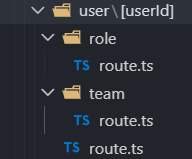

1. Create Next.js 16 project
   `npx create-next-app@latest`
2. Add auth and user api routes.
   
   
3. Add dependencies.
   `npm install @prisma/client@6 prisma@6 bcryptjs jsonwebtoken`
   `npm install -D @types/jsonwebtoken`
4. Add types in `types/index.ts`.
5. Initialize prisma.
   i. Add `prisma/schema.prisma` file with config and models.
   ii. Add scripts in `package.json` for prisma.
   iii. Run generate and push commands to create the schemas.
