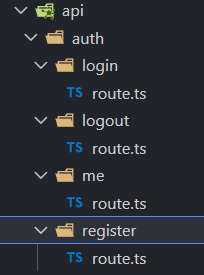
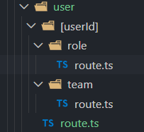

1. Create Next.js 16 project
   `npx create-next-app@latest`
2. Add auth and user api routes.
   
   
3. Add dependencies.
   `npm install @prisma/client@6 prisma@6 bcryptjs jsonwebtoken`
   `npm install -D @types/jsonwebtoken`
4. Add types in `app/types/index.ts`.
5. Initialize prisma.
   i. Add `prisma/schema.prisma` file with config and models.
   ii. Add scripts in `package.json` for prisma.
   iii. Run generate and push commands to create the schemas.
6. Import prisma client to use in the repo in `app/lib/db.ts`.
7. Create a helper function in `app/lib/db.ts`to check database connection.
8. Create a health api to check database connection using rest api.
9. Add `JWT_SECRET` in env file.
10. Create helper functions for auth development.
    i. hashPassword
    ii. verifyPassword
    iii. generateToken
    iv. verifyToken
    v. getCurrentUser
    vi. checkUserPermission
11. Create register endpoint.
    i. Validate required fields
    ii. Validate existing user
    iii. Validate team code
    iv. Hash the password
    v. Assign role to the user
    vi. Create user
    vii. Generate token
    viii. Create response
    ix. Set cookie with token and other settings
    x. Handle errors gracefully with try/catch block
12. Create logout endpoint that removes the cookie.
13. Create login endpoint.
    i. Validate required fields
    ii. Validate user
    iii. Validate password
    iv. Generate token
    v. Create response
    vi. Add cookie to the response
14. Create endpoint to get current user using `getCurrentUser()` auth utility function.
15. Create get user by role and/or teamId as per role authority
